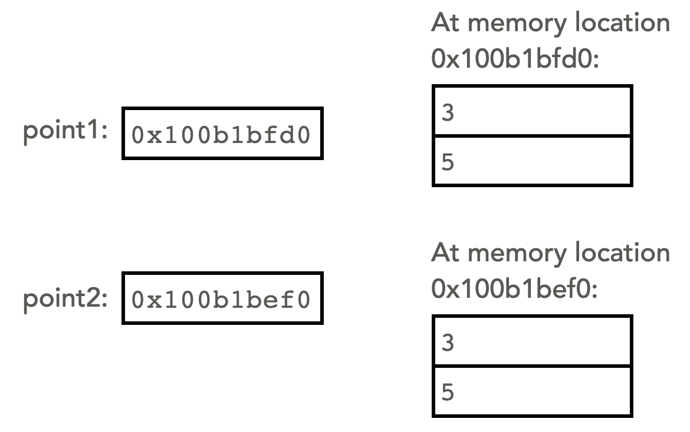
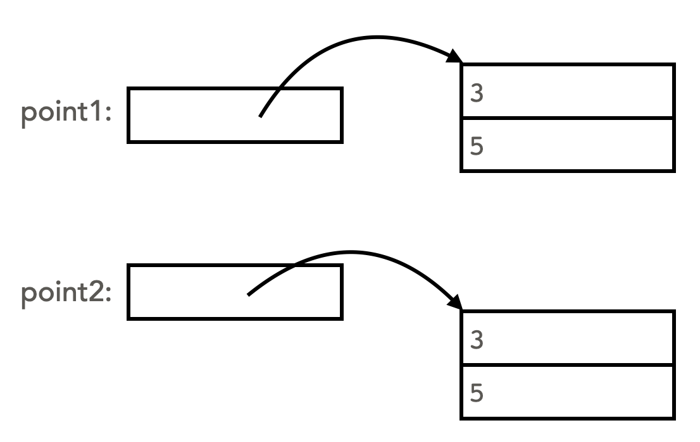
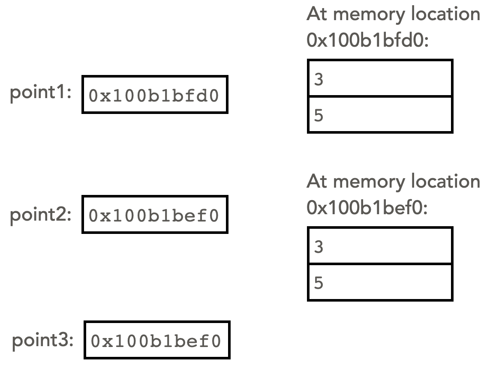
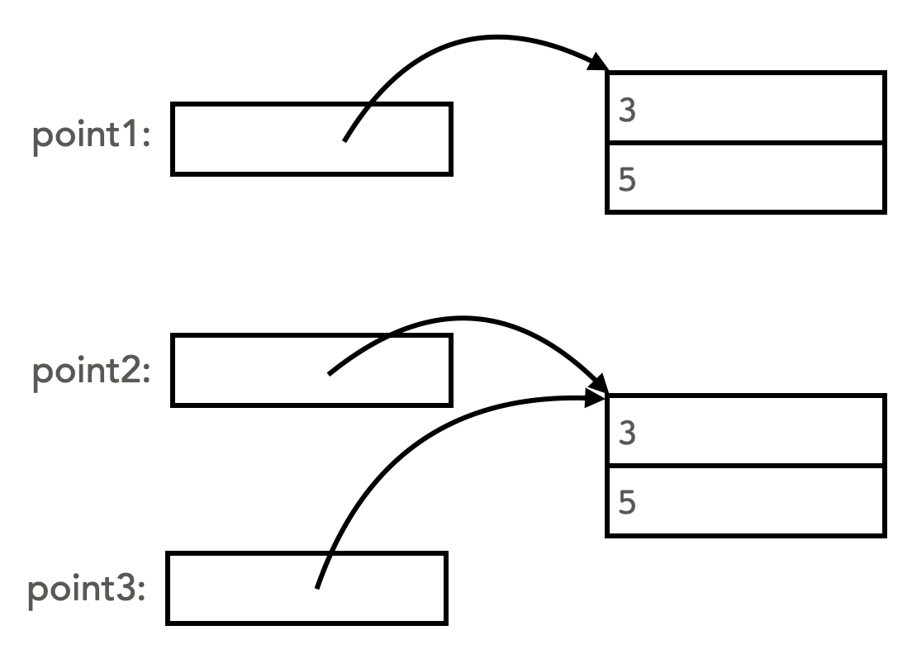

# Variables are references to objects

A variable that refers to an object is technically a reference. This means that the variable stores the memory address of the object itself (in other words, the location in your computer's memory where the full data for the object is stored). To see this in action, consider this implementation of the class `Point`, which has no `__str__()` method:

```python
from __future__ import annotations

class Point:

    def __init__(self, x, y):
        # initialize the values of the point (x, y)
        self.x = x
        self.y = y
    
    def __add__(self, other: Point)->Point:
        return Point(self.x+other.x, self.y+other.y)

    def __eq__(self, other: Point)->bool:
        return self.x==other.x and self.y==other.y
    
# main code block:
point1 = Point(3, 5)
point2 = Point(3, 5)
print(point1)
print(point2)
```
output:
```
<__main__.Point object at 0x100b1bfd0>
<__main__.Point object at 0x100b1be50>
```
Without the `___str__()` function to override the form of the output, python returns the contents of the variable, which is its memory address (shown in the above output as a hexadecimal number).

The number stored in the variable is a memory address. Examining the values stored *at that memory address*, we find the actual data associated with the object.  So the variable is a *reference* of where to find the actual contents of the object. We can represent this situation visually with this memory diagram:



It is awkward to write the values of the memory addresses themselves, in particular because without running the program, we do not even know what these memory addresses will be. Therefore, by convention we represent memory diagrams like the one above with arrows. The start of the arrow is *inside* the reference variable, and the arrow points to the part of the diagram where the data itself is held.



We view these memory diagrams as equivalent, and we prefer the second version. The arrows make it clear that each variable is a reference to an object.

## The python `id()` function

Suppose we now implement the `__str__()` method in the `Point` class, as shown below:

```python
class Point:

    def __init__(self, x, y):
        # initialize the values of the point (x, y)
        self.x = x
        self.y = y
    
    def __add__(self, other: Point)->Point:
        return Point(self.x+other.x, self.y+other.y)

    def __eq__(self, other: Point)->bool:
        return self.x==other.x and self.y==other.y
    
    def __str__(self)->str:
        return f"({self.x}, {self.y})"

# main code block:
point1 = Point(3, 5)
point2 = Point(3, 5)
print(point1)
print(point2)
```
output:
```
(3, 5)
(3, 5)
```
Now that the `__str__()` has been implemented, when we output the object to the terminal, we no longer see the memory address. However, we can still find out the memory address where the object is stored by using the python `id()` function:
```python
print(id(point1))
print(id(point2))
```
output:
```
4306616272
4306615888
```
These are the memory addresses of where the objects are stored, in decimal.

Note that the two ids that are output are not the same. Even though `point1` and `point2` have the same values, they are distinct objects, stored in separate memory locations. Note that if we were to change the x or y values of one of the points, the other would not change, since they are separate objects.

## Copying references

Suppose we modify the main code block to the following:
```python
# main code block:
point1 = Point(3, 5)
point2 = Point(3, 5)
point3 = point2
```
The last line in the above code is an assignment statement, that stores in `point3` the value found in `point2`. Since that value is a reference (a memory address), the result is to copy the memory address to `point3`. Here is a memory diagram showing the result of the assignment statement. Note that `point2` and `point3` store the same memory address, so they have the same id.




The abstract version of this diagram (using arrows instead of actual memory addresses) is below. The arrows make it more obvious that two variables are referring to the same object. There are only two different `Point` objects, since only two `Point` objects were instantiated.




