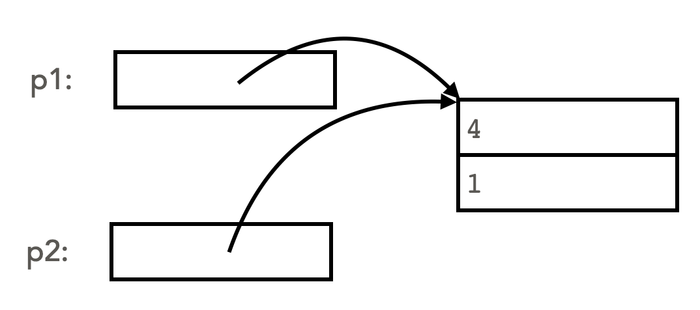
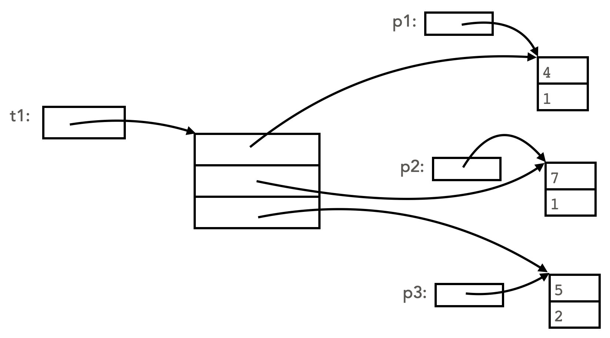
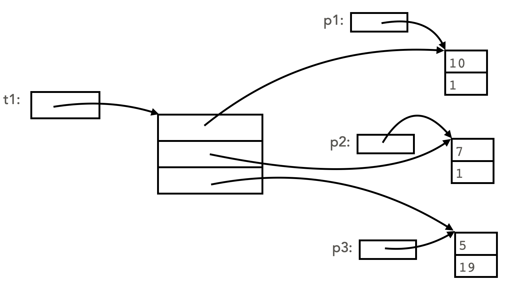

# Drawing memory diagram of complicated objects

In a previous section ([Variables are references](variables_are_references.md)), we learned that variables hold references to objects (i.e., a variable contains the memory address where the object itself is stored), and we learned how to draw memory diagram to represent this. Trace the following code and predict the output as a review of these concepts:

## A simple example
Consider the following code:
```python
class Point:

    def __init__(self, x, y):
        # initialize the values of the point (x, y)
        self.x = x
        self.y = y

    def __str__(self)->str:
        # format the string in (x, y) form
        return f"({self.x}, {self.y})"
    
class Triangle:

    def __init__(self, v1: Point, v2: Point, v3: Point):
        self.vertex1 = v1
        self.vertex2 = v2
        self.vertex3 = v3

    def __str__(self)->str:
        return f"Vertices: {self.vertex1} {self.vertex2} {self.vertex3}"

# main code block:
p1 = Point(4, 1)
p2 = p1
p1.x += 1
print(p2)
```
The memory diagram below shows the state of the objects right before the code `p1.x += 1` executes:



After the line `p1.x += 1` executes, the instance variable `x` in object that `p1` refers to is changed:


But notice that `p1` and `p2` refer to the same object (they have the same identity, i.e., `p1 is p2` is `True`), so when we output `p2`, we see that same change reflected. Thus the output is `(5,1)`. Drawing a memory diagram helps us trace more carefully through the code.

## A more complicated example

Now let's instantiate a `Triangle` object, which is more complicated since it has instance variables that are themselves objects. These instance variables are themselves references.
```python
# main code block
p1 = Point(4, 1)
p2 = Point(7, 1)
p3 = Point(5, 2)
t1 = Triangle(p1, p2, p3)
```
Here's a diagram showing the state of memory after the above code executes. Examine each box and arrow carefully. Notice in particular that each of the vertex instance variables refer to objects, so they each contain an arrow that points to a `Point` object. Notice also that `p1`, `p1` and `p3` are part of the diagram, and they refer to the same `Point` objects as are stored in the `Triangle` `t1`.



Aided by the above memory diagram, trace through the following code, to be run after the main code block above, and predict its output:
```python
p1.x = 10
t1.vertex3.y = 19
print(p3)
print(t1)
```
Answer:
```
p3: (5, 19)
Vertices: (10, 1) (7, 1) (5, 19)
```
Since `p1` refers to the same object as `t1.vertex1`, when `p1` is changed, so is `t1.vertex1`. Similarly, since `t1.vertex3` refers to the same object as `p3`, when `t1.vertex3` is changed, so is `p3`. Here is the final memory diagram showing the changes:




