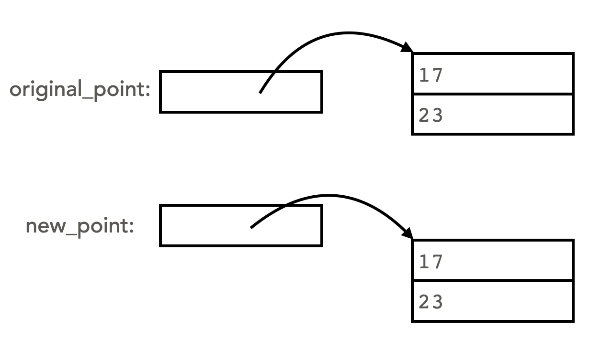
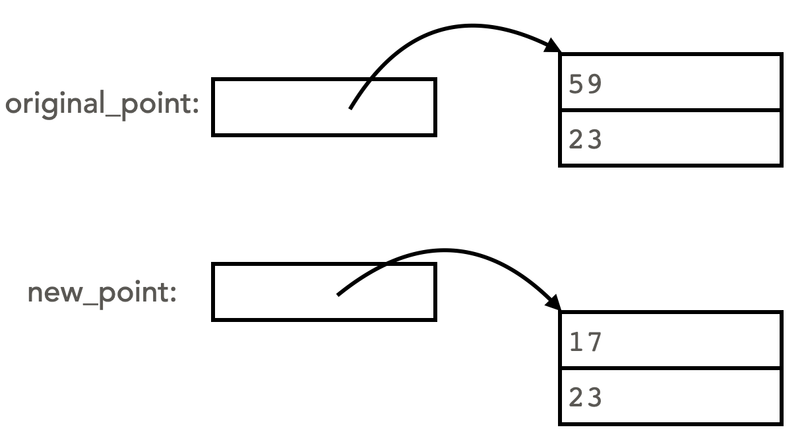
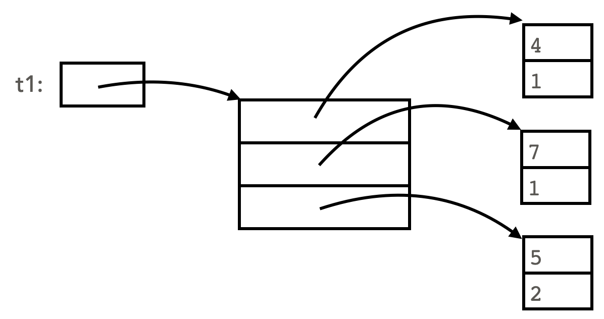
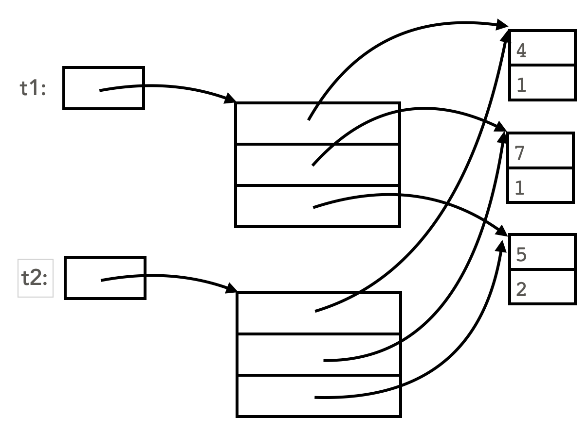
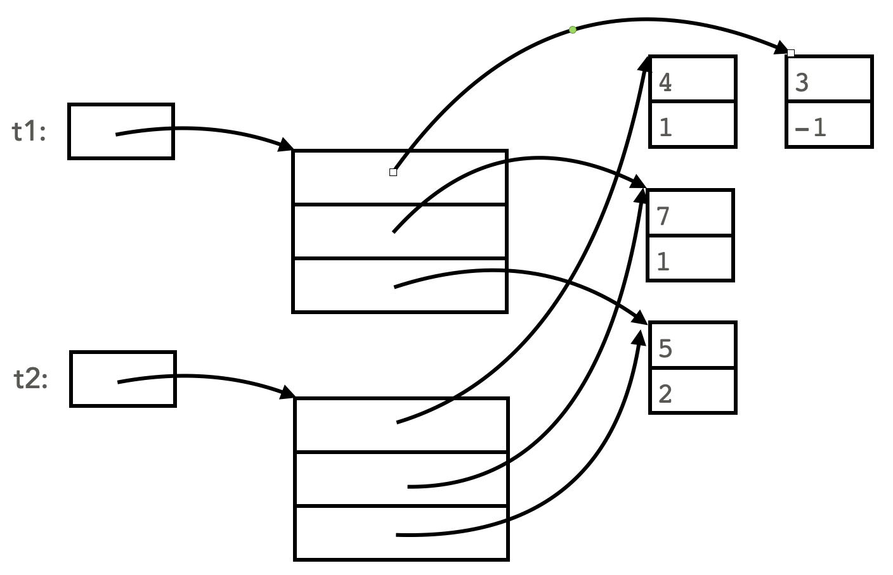
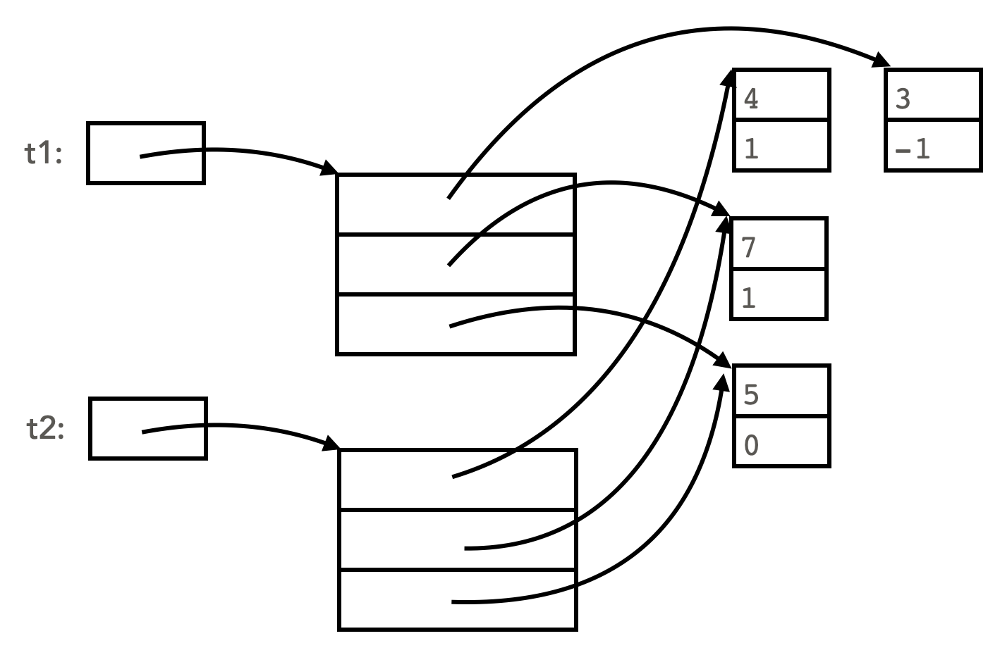
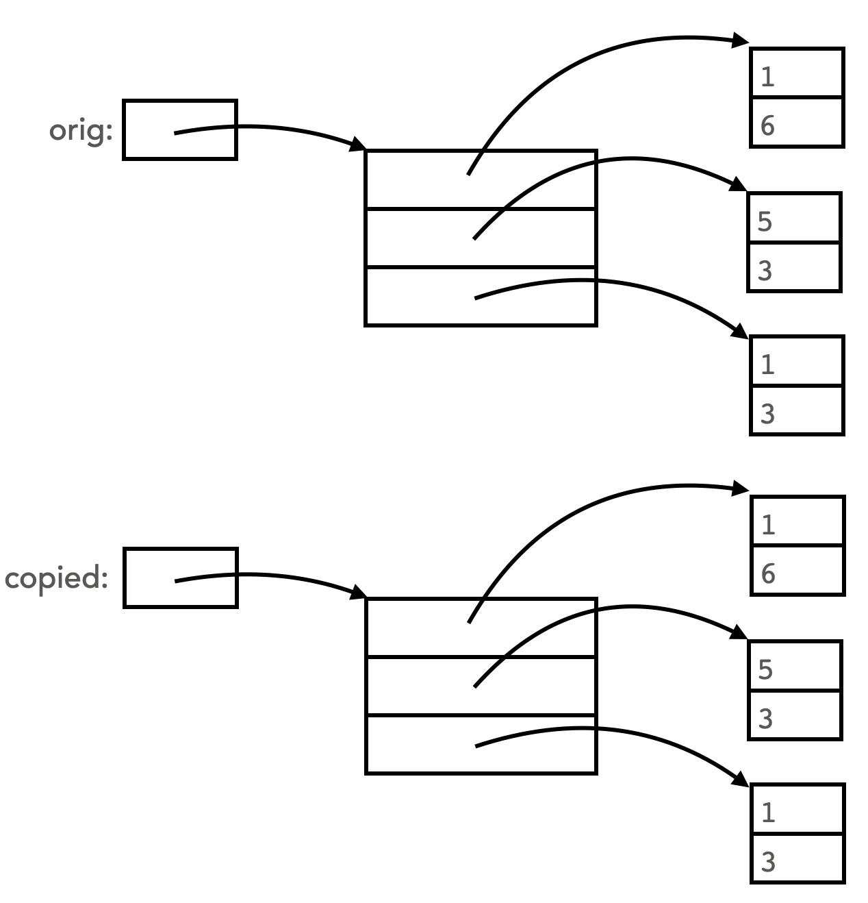
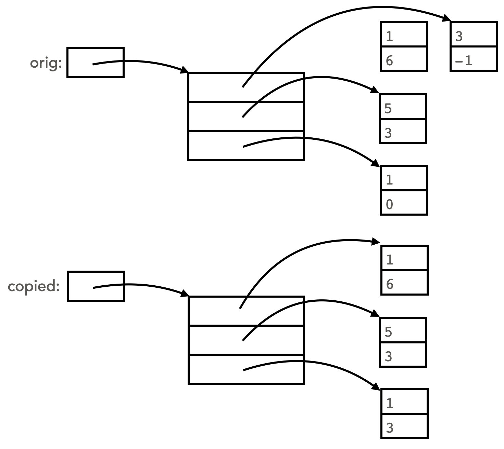

# Copy reference, versus shallow copy, versus deep copy

There are three levels of copying an object:
* copy a reference
* shallow copy
* deep copy

In the explanations below, we will refer to the following classes:

```python
class Point:

    def __init__(self, x: float, y: float):
        # initialize the values of the point (x, y)
        self.x = x
        self.y = y

    def __str__(self)->str:
        # format the string in (x, y) form
        return f"({self.x}, {self.y})"
    
class Triangle:

    def __init__(self, v1: Point, v2: Point, v3: Point):
        self.vertex1 = v1
        self.vertex2 = v2
        self.vertex3 = v3

    def __str__(self)->str:
        return f"Vertices: {self.vertex1} {self.vertex2} {self.vertex3}"
```

## Copy a reference

You've already seen the idea of copying a reference. Consider this code:
```python
p1 = Point(4, 1)
p2 = p1
p1.x = 5
print(p2.x) # outputs 5
```

In the first line above, a `Point` object called `p1` is instantiated. Since `p1` is actually a reference to the `Point` object, the next line makes a copy of that reference. Thus `p1` and `p2` refer to the same object. In the third line, the `x` instance variable of `p1` is changed. Since `p2` refers to the same object, on line 4, naturally `p2.x` also has the value 5.  Here is the memory diagram showing the situation:

<table>
<tr><td>Before:</td><td>After:</td></tr>
<tr>
<td></td>
<td></td>
</tr>
</table>

## Shallow copy

Sometimes we don't want to copy a reference, but instead we want to make a true copy of an object. The first way to do this in python is with a shallow copy, implemented in the `copy` function from python's `copy` module. To use this function, call `copy.copy(original_object)`, and it returns a new object of the same type, with each instance variable copied from the original. For example:

```python
import copy
original_point = Point(17, 23)
new_point = copy.copy(original_point)
original_point.y = 59
print(original_point)   # outputs (59, 23), it has been modified
print(new_point)        # outputs (17, 23), the copy was not modified
```

<table>
<tr>
<td>After `new_point = copy.copy(originl_point)`</td>
<td>After `original_point.y = 59`:</td></tr>
<tr>
<td></td>
<td></td>
</tr>
</table>

Notice `new_point` is a copy of the original. It is a separate object. Though its values are the same, it has a different id. Thus, when the value of `original_point.y` is changed, that change will not affect `new_point`.

## A shallow copy is not always ideal, since it only copies one level of depth

Let's look at what a shallow copy does on a more complex object:
```python
# Create Triangle object and make a shallow copy of it
t1 = Triangle(Point(4, 1), Point(7, 1), Point(5, 2))
t2 = copy.copy(t1)   # shallow copy!
print(t1)            # outputs Vertices: (4, 1) (7, 1) (5, 2)
print(t2)            # outputs Vertices: (4, 1) (7, 1) (5, 2)
```

Let's examine in detail what happens with the shallow copy. Start with the memory diagram for `t1`:


Recall that a shallow copy will copy each instance variable of an object. The three instance variables for `t1` are each references (`t1.vertex1`, `t1.vertex2`, and `t1.vertex3`). So all three of these references get copied to the new object `t2`. Copying the three references does not create new objects. The result is that `t2`'s instance variables(`t2.vertex1`, `t2.vertex2`, and `t2.vertex3`) point to the same `Point` objects as `t1`. The two triangles share these `Point` objects!



The shallow copy works fine when we change one of the instance variables of the original object (i.e., replace one of the vertex `Point`s)

```python
# Change the first vertex of t1 to a new Point object:
t1.vertex1 = Point(3, -1)
print(t1)  # The triangle has been modified to Vertices: (3, -1) (7, 1) (5, 2)
print(t2)  # still outputs Vertices: (4, 1) (7, 1) (5, 2)
```

The behavior still makes sense - the copied triangle does not change when the first triangle is modified. Here is the memory diagram after the above code has been executed. Notice that `t1.vertex1` now refers to a brand-new `Point`.



But the behavior of the shallow copy doesn't satisfy our needs in this case when we change intance variables in the underlying `Point` objects:
```python
t1.vertex3.y = 0
print(t1)    # As expected, y value of last vertex is modified: Vertices: (3, -1) (7, 1) (5, 0)
print(t2)    # t2 is a copy, yet the value of its last vertex also changed: Vertices: (4, 1) (7, 1) (5, 0)
```
Here is the memory diagram after the last segment of code has run. Notice that the y-coordinate of `vertex3` has been modified, for both triangles.



We see that for objects with more than one level, a shallow copy might lead to unwanted side effects when changing values on the second level or deeper. To solve this problem, the python `copy` module provides a function called `deepcopy()`.

## Deep copy

A call to `copy.deepcopy(original_object)` returns an new object that is a full copy of `original_object`. Any object that `original_object` refers to is also copied. This instantiation of copies happens at every level of depth of the object being copied.

For example, consider this code:
```python
orig = Triangle(Point(1, 6), Point(5, 3), Point(1, 3))
copied = copy.deepcopy(orig)
```
Here's a memory diagram of the two objects after the deep copy:



Notice that the three `Point`s representing the vertices of the original triangle all got copied.
The deep copy completely detaches connection between the two objects. So modifications made to one of the triangles cannot possibly affect the other triangle. For example, the code below swaps out a new point for `orig.vertex1`, and also changes an individual component of `orig.vertex3`. Neither of these affect the `copied` triangle.

```python
orig.vertex1 = Point(3, -1)
orig.vertex3.y = 0
```



Side note: in the above memory diagram, `orig.vertex1` was changed to a newly-instantiated `Point`. This means that there are no longer any arrows pointing to the initial point `orig.vertex1`. Since there are no remaining references to this point, it can no longer be accessed from within this program. Python "cleans up" these orphaned objects through a process called *garbage collection*. Garbage collection recovers space in memory to potentially be used by python later in the running of the program.


