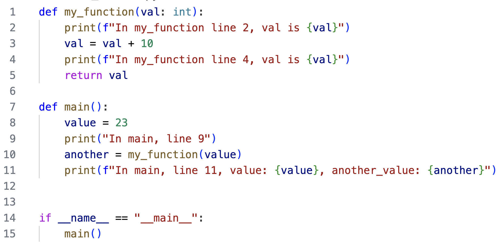
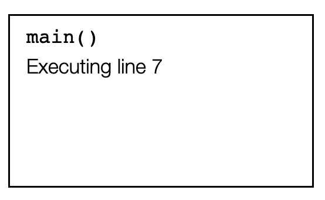
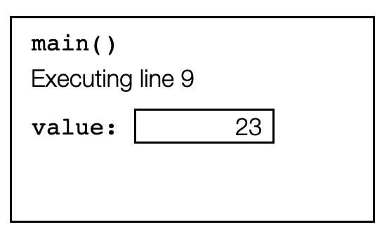
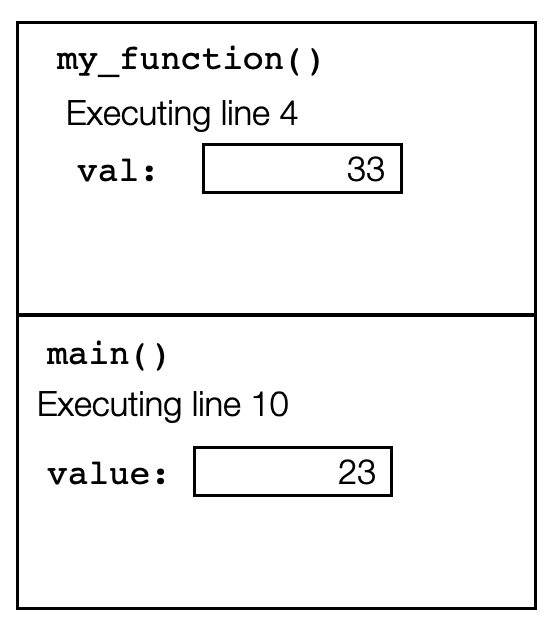
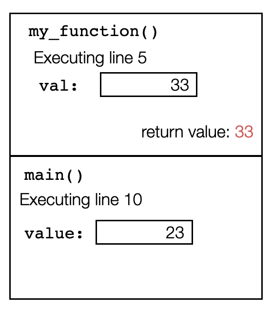
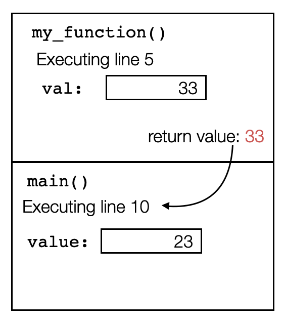
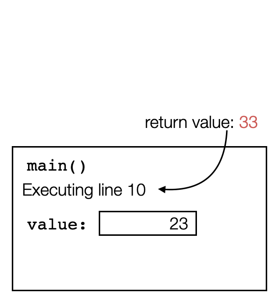
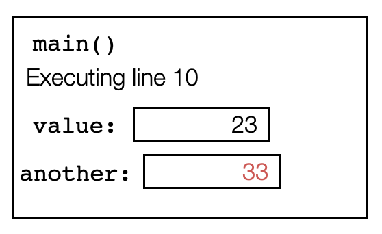

# Drawing memory diagrams to represent the call stack

Consider a python program that has function calls. Here is a simplest example:
```
def my_function(val: int):
    print(f"In my_function line 2, val is {val}")
    val = val + 10
    print(f"In my_function line 4, val is {val}")
    return val

def main():
    value = 23
    print("In main, line 9")
    another = my_function(value)
    print(f"In main, line 11, value: {value}, another_value: {another}")


if __name__ == "__main__":
    main()
```

Below is an image of the same program, with line numbers that we will refer to while tracing the function.


Please stop reading for a moment to trace the code by hand, giving the output. Run the code to double-check.

Notice that when the code runs line 10, it must evaluate the right-hand side by calling `my_function(value)` before it can
store the return value in the variable `another`. When the function `my_function(value)` is called, running of the function `main()` is paused until `my_function` completes running and returns. At that point program control returns to line 10 and
picks back up where it left off.
When we trace code by hand, we naturally remember exactly where we paused, and even the values of the local variables. This allows us seamlessly resume running line 10 after `my_function` completes executing and returns. However, unlike humans, computers have no natural or automatic process for remembering. Thus, when a function is called, all information about the current values of local variables and the line currently being executed must be stored. They are stored in the call stack.

The call stack consists of individual frames. When a function begins execution, a frame is added to the top of the call stack (we call it "pushed" onto the stack). Each frame stores the current line number being executed, as well as the values of every local variable. When a new
function is invoked, a new frame is created and added to the top of the call stack.

Here is a memory diagram showing the state of the call stack when the program is executing line 7:



The next line creates a variable called `value`, and stores the value `23` there. Here is the call stack memory diagram when the program is executing line 9. Notice that a new local variable has been added to the frame for the function `main`:



On line 10, the program calls the function `my_function()`. This means that the funtion `main()` pauses its execution. A new frame for this call to `my_function` is created and added to the top of the call stack. The top frame on the call stack always shows the information for the function that is currently executing. Here is the call stack memory diagram when the program has invoked `my_function()` and is executing line 2. Notice that `val` is passed as a parameter, so it behaves like a local variable. Its value is initialized with the value that was passed (23 in this case). The variable exists only as long as the function is still executing. Thus we draw it in the frame associated with `my_function()`:


On line 3, the value stored in `val` is changed. Notice that only the local variable is modified. Since `my_function()` only has access to the local variables stored in its own frame, the variables owned by `main()` cannot be modified by this function. Here is the call stack memory diagram when the program is executing line 4:



On line 5 of the program, `my_function()` has completed execution and will return program control to the calling function (`main()` in this case). Python knows which frame to return to and which line to resume by looking at the *next frame down on the stack*. So the return value is passed back to the function call in the frame below, the frame for `my_function()` is destroyed (we call it getting "popped" from the stack), and main resumes its process on the line stored in the frame.

<table>
<tr>
    <td></td>
    <td></td>
    <td></td>
</tr>
<tr> 
    <td>The return value is computed</td>
    <td>The return value is passed back to the calling function (next frame down the stack)</td>
    <td>`my_function()` is complete, so its frame is deleted (popped) from the stack</td></tr>
</table>

Back on line 10, the return value is assigned to the variable `another`. Here is the call stack memory diagram when line 10 of the program is done executing:

</td>

More details of how the memory diagrams above were built are shown in this video:
<video src="https://cs.du.edu/~ftl/1352/videos/call_stack_simplest_case.mp4" width="480" height="270" controls></video>

# Another example

The video below demonstrates tracing through the following code, and maintaining the call stack memory diagram through each step.
```
def fourth(number: int)->int:
    partial_result = cube(number)
    return partial_result*number

def cube(number: int)->int:
    partial_result = square(number)
    return partial_result*number

def square(number: int)->int:
    return number*number

def main():
    value = int(input("What integer do you want? "))
    print(f'The fourth power of {value} is {fourth(value)}')

if __name__ == '__main__':
    main()
```

<video src="https://cs.du.edu/~ftl/1352/videos/call_stack_second_demo.mp4" width="480" height="270" controls></video>

# Tools for visualizing

* The debugger in VSCode can be used to see the call stack (see the bottom window of the debug pane). It doesn't show the entire frame for each function call, but lists the calls.
* Python tutor (https://pythontutor.com/visualize.html#mode=edit) is a valuable online tool for stepping through code. It shows the call stack, including all local variables.

This video demonstrates using both of these tools for tracing, debugging, and seeing the contents of the call stack:

<video src="https://cs.du.edu/~ftl/1352/videos/tools_demo.mp4" width="480" height="270" controls></video>


