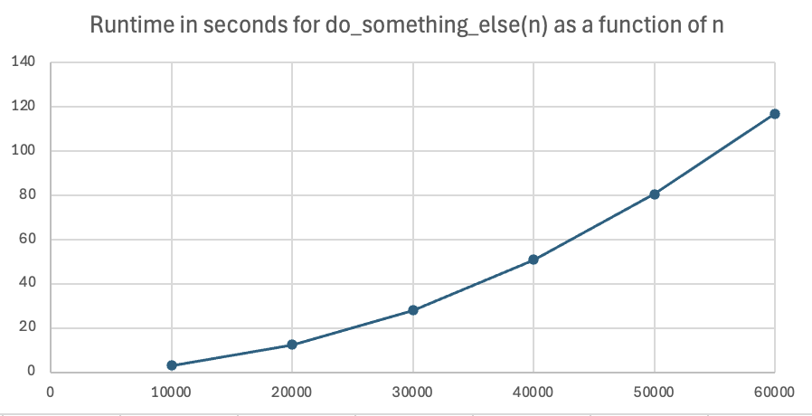

# Timing a function for a variety of values of `n`

If a function takes a parameter that represents the size of the problem (number of elements in a list, or number of repeats of a loop),
then we are very interested in how the execution time grows as the size of the problem grows. 
The pattern of this change is called the *order of growth* or *time complexity* of the algorithm.

- If doubling the size of `n` results in a doubling of the execution time for the algorithm, then we call the algorithm *Big-O of n* or *linear*. We write this \\(O(n)\\).
  
- If doubling the size of `n` results in a quadrupling of the execution time, then we call the algorithm *Big-O of n squared* or *quadratic*. We write this \\(O(n^2)\\).

- If doubling the size of `n` results in a factor of 8 increase of the execution time, then we call the algorithm *Big-O of n-cubed* or *cubic*. We write this \\(O(n^3)\\).

The code below is a modification of the original timing code, but with an extra loop that modifies the size of `n`.
Carefully compare the two versions, enough so you could make the modification yourself.
```python
import time

def do_something(n: int) -> None:
    # How long does this take to run?
    count = 0
    for i in range(n):
        count += 1

def main():
    # time the execution of the function for 
    # n = 100 million to 600 million
    for n in range(100000000, 600000001, 100000000):
        # Record the start time
        start_time = time.time()
        # Execute the function
        do_something(n)
        # Record the finish time
        finish_time = time.time()
        elapsed_time = finish_time - start_time
        print(f"runtime for do_something({n}): {elapsed_time:.2f} seconds")

if __name__ == "__main__":
    main()
```
Sample output:
```
runtime for do_something(100000000): 3.13 seconds
runtime for do_something(200000000): 6.18 seconds
runtime for do_something(300000000): 9.24 seconds
runtime for do_something(400000000): 12.41 seconds
runtime for do_something(500000000): 15.50 seconds
runtime for do_something(600000000): 18.69 seconds
```
We can see by a rough look at the data above that the algorithm shows linear, or \\(O(n)\\), behavior. Look at the time behavior when `n` is doubled or tripled:

When the size of `n` is doubled from 100 million to 200 million, the time approximately doubles (\\(6.18 sec/3.13 sec \approx 2\\)).

When the size of `n` is tripled from 100 million to 300 million, the time approximately triples (\\(9.24/3.13 \approx 3\\)).

When the size of `n` is doubled from 300 million to 600 million, the time approximately doubles (\\(18.69/9.24 \approx 2\\)).

When the size of `n` is tripled from 200 million to 600 million, the time approximately triples (\\(18.69/6.18 \approx 3\\)).

We can also see linear behavior by graphing the data, which appears to be a line:


## Another example of timing a function for a variety of values of `n`
Here's another example. The new function is `do_something_else()`. 
Since it runs much slower, the experimental values of `n` are chosen to be smaller (ranging from 10000 to 60000):
```python
import time

def do_something_else(n: int) -> None:
    # How long does this take to run?
    count = 0
    for i in range(n):
        for j in range(n):
            count += 1

def main():
    # time the execution of the function for 
    # n = 10000 to 60000
    for n in range(10000, 60001, 10000):
        # Record the start time
        start_time = time.time()
        # Execute the function
        do_something_else(n)
        # Record the finish time
        finish_time = time.time()
        elapsed_time = finish_time - start_time
        print(f"runtime for do_something_else({n}): {elapsed_time:.2f} seconds")

if __name__ == "__main__":
    main()
```
Sample output:
```
runtime for do_something_else(10000): 3.09 seconds
runtime for do_something_else(20000): 12.37 seconds
runtime for do_something_else(30000): 28.08 seconds
runtime for do_something_else(40000): 50.97 seconds
runtime for do_something_else(50000): 80.41 seconds
runtime for do_something_else(60000): 116.78 seconds
```
This time, a rough look at the data above indicates that the algorithm shows quadratic, or \\(O(n^2)\\), behavior. Look at the time behavior when `n` is doubled or tripled:

When the size of `n` is doubled from 10000 to 20000, the time increases by approximately a factor of 4 \\(12.37/3.09 \approx 4.003\\)).

When the size of `n` is tripled from 10000 to 30000, the time increases by approximately a factor of 9 (\\(28.08/3.09 \approx 9.09\\)).

When the size of `n` is doubled from 30000 to 60000, the time increases by approximately a factor of 4 (\\(116.78/28.08 \approx 4.16\\)).

When the size of `n` is tripled from 20000 to 60000, the time increases by approximately a factor of 9 (\\(116.78/12.37 \approx 9.44\\))

Graphing the data hints at a parabolic (quadratic) shape. Caution though: while this graph convinces us that
the time complexity is not linear, graphs that are concave up might represent quadratic, cubic, exponential, or other growth rates.




## Video explanations
<video src="https://cs.du.edu/~ftl/1352/videos/functions/measuring_runtime_n.mp4" width="480" height="270" controls></video>
