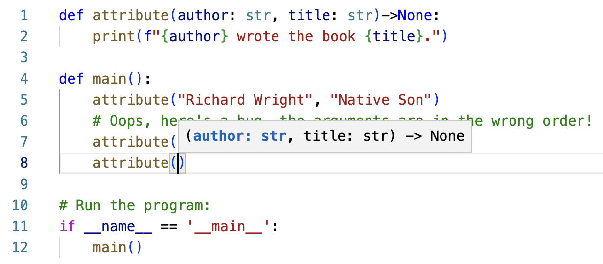

# Keyword arguments

In the header of a function definition, you name the parameters. These names are local variable names, meaning that the variables are only accessible within the function definition itself. In the line that *invokes* (or *calls*) the function, values (called *arguments*) are passed to fill in as the values of the parameters. These arguments must be passed in the correct order. Consider this example:

```python
def attribute(author: str, title: str)->None:
    print(f"{author} wrote the book {title}.")

def main():
    attribute("Richard Wright", "Native Son")
    # Oops, here's a bug, the arguments are in the wrong order!
    attribute("Harry Potter", "J.K. Rowling")

# Run the program:
if __name__ == '__main__':
    main()
```
Output:
```
Richard Wright wrote the book Native Son.
Harry Potter wrote the book J.K. Rowling.
```

In `main()`, the line 
```
attribute("Richard Wright", "Native Son")
```
invokes the `attribute()` function, with `"Richard Wright"` as the `author` and `"Native Son"` as the title. Notice, however, that the arguments are mistakenly in the wrong order on the next line:
```
attribute("Harry Potter", "J.K. Rowling")
``` 
`"Harry Potter"` should have been the second argument (the title), and `"J.K. Rowling"` should have been the first argument (the author). Keyword arguments are intended to avoid bugs created by this type of mistake, and to simultaneously make code more readable.

To use a keyword argument, we give the name of the parameter along with the argument. For example:
```python
attribute(author = "Richard Wright", title = "Native Son")
```
The parameter names should exactly match the names given in the definition of the function itself. VSCode will tell you the name of the parameters so you don't have to refer back to the function definition to remember the names and order of the parameters. To access this feature, type Command-Shift-Space on a Mac, or Control-Shift-Space on Windows. This image shows what the parameter-hinting looks like in VSCode:



When you use keyword arguments, your code is often easier to understand, because the names of the variables makes the meaning of each argument clear.
If you use keyword arguments and you put the arguments in the wrong order, the values of the arguments are assigned by the variable names, not the order. However, we strongly advise that even when using keywords, you maintain the order of the variables in the function definition. Using the features of your IDE makes this easy.

```python
# Use keyword arguments to clarify and to reduce bugs:
attribute(author = "Margaret Wise Brown", title = "Goodnight Moon")
# Above we use keyword arguments with the arguments out of order
# Below is poor programming practice since the parameters are out of order. But notice that it still works:
attribute(title = "Harry Potter", author = "J.K. Rowling")
```
Output:
```
Margaret Wise Brown wrote the book Goodnight Moon.
J.K. Rowling wrote the book Harry Potter.
```

## Video explanations
<video src="https://cs.du.edu/~ftl/1352/videos/functions/keyword_arguments.mp4" width="480" height="270" controls></video>
