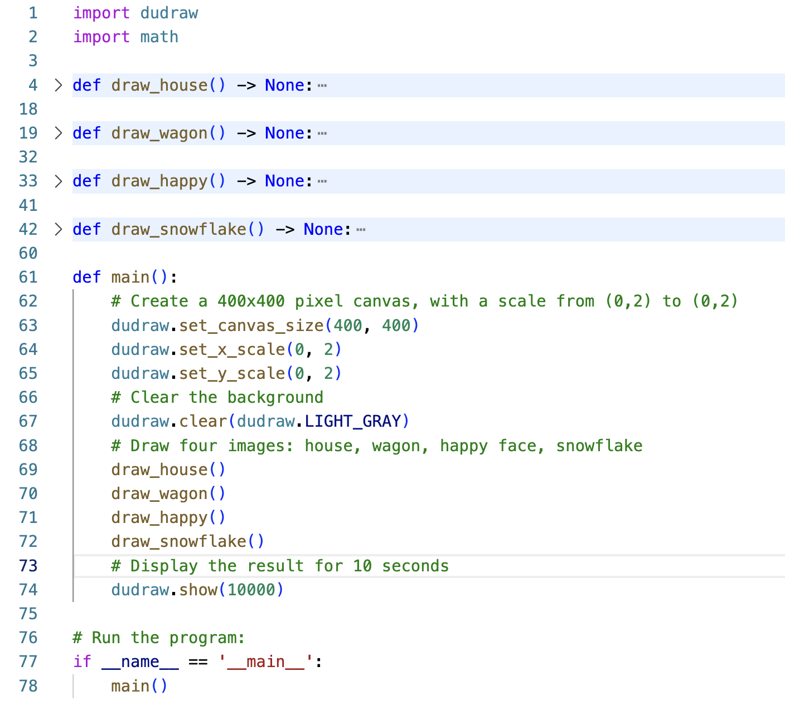

# User-defined functions in python

Most programming languages give you a way to separate a block of code from the main program. This is useful to
- provide organization to your program by chunking it into blocks that perform specific tasks, and
- allow you to reuse a block of code rather than repeat it.

## Creating user-defined functions

This is the syntax for creating a user-defined function:

```python
def function_name() -> None:
    # Code block for the function
```

Key points:
- The keyword `def` signals the beginning of a function definition.
- The empty pair of parentheses `()` indicates that this function does not take any arguments (input values to the function). Function arguments are explained in a later section.
- The `-> None` indicates that the function does not return any values. Function return values are explained in a later section.
- Defining functions is not completely new to you - you have defined the function `main()` in every program you have written.
- When you define a function, note that the code in the function is **not executed**. The code within the function is executed only when you *call* the function.
- Think of the function definition as a recipe, telling python exactly what to do when another part of the program calls the function.
- *Calling* a function means to use it, or to *run its code*. We also say *execute* the function or *invoke the function*.  To call a function, at the point where you want it to run, write the name of the function, with parentheses.

Example:

Here is the definition of a function called `greet_user()`. It asks the user their name, then says hello, using their name:

```python
def greet_user() -> None:
    name = input("What is your name? ")
    print("Hello,", name)
```

In the above code, nothing is executed. The lines of code within the function only get executed when the function is called. Consider the following program that defines and uses (calls) the function `greet_user()`:

<figure>

</figure>

In the above code, lines 1-3 are the *definition* of the `greet_user()` function. Those lines define what you want python to do whenever `greet_user()` is called. On line 6, the `greet_user()` function is called. So when python executes line 6, it puts `main()` on hold, jumps to line 1, and executes the contents of the `greet_user()` function. That's the moment that the user is asked for their name, and the greeting is output. After that completes, the running of the program reverts back to line 6 in `main()` and continues from there.

## Commenting functions

In this course, we will have a standard for commenting every function. After the `def` line, put a block comment explaining the purpose of the function. This special block comment is called a *docstring*. When we learn about parameters and return values, we will add additional information into these docstrings.

Example:
```python
def greet_user() -> None:
    """
    First example of a user-defined function. Ask user for their name, then
    output "Hello, ", followed by their name
    """
    name = input("What is your name? ")
    print("Hello,", name)
```

## Putting it all together

The following code shows a program that defines and uses several functions. Each of these functions defines how to draw a part of the final image. The definition of each function has been collapsed - you can't see the contents. This is actually helpful, because while looking at the program from the highest level, the details are distracting. Notice that in `main()` we can easily see the overall task of the program from the four function calls. If the details of drawing each shape were placed into one long `main()` function, the higher-level organization of the program would be lost, mired in the details. This demonstrates the importance of using functions to break down code into bite-sized chunks.

<table>
<tr>
<td>Code</td><td>Image produced</td>
</tr>
<tr>
<td>

<figure>

</figure>

</td>

<td>

<figure>

</figure>
</td>

</tr>
</table>

## Summary

A function definition is a collection of code statements grouped together that perform a specific task.

Every function has a name that can be used to *call* the function. We also use the terms *invoke*, or *execute* to mean *run the lines of code that appear within the function definition*.

You can think of the function definition as a recipe for how to perform a task. When the function is invoked, then the task is actually performed.

### Why use functions?

There are three main reasons that functions are useful in programming:

- Reusability

    Often we need to use the same code multiple times.
    One solution is to copy/paste the code to reuse it. A downside of that strategy is that it makes our programs much longer. But an even worse downside is that if we make a modification, we need to find and make that same change in every place we copied the code to. Functions instead allow us to efficiently invoke the same code whenever needed without making multiple copies.

- Abstraction

    Once a function has been written and tested, we don't need to know how it works anymore. We only need to remember its **name, purpose, parameters, and return value**. For example, when you use the `dudraw.circle()` function, you can just use it without bothering your mind with the distraction of how that function creates the circle. This allows us to build functions from functions already written, and thus produce very complicated software much more easily.

- Code organization and readability

    Organizing  your code into a sequence of function calls allows you to focus while you are programming on just the task at hand. It also makes it far easier for others to read your code and understand it.

### Next up: arguments and return values

The next two sections cover the following topics:

Functions may take input values (called arguments or parameters) that modify or control how the function runs. This allows the line of code that invokes the function to pass needed information to the function.

Functions may also have output values (called return values). Usually this is the result of some work that the function has completed. It is a way for the function to pass back needed information to the function that called it. 