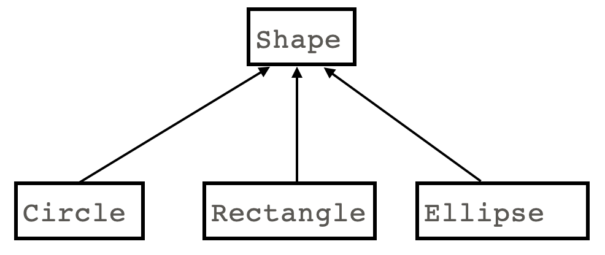

# Inheritance

## The purpose of inheritance

Suppose we want to create classes to represent objects from a general category (such as shapes), where each object also belongs to a more specific category (such as circles, rectangles, or ellipses). Rather than make several unrelated classes, we instead model the situation with the following class diagram:

<center>

</center>

The above diagram implies that `Shape`, `Circle`, `Rectangle` and `Ellipse` are all classes. It also implies that `Circle`, `Rectangle` and `Ellipse` automatically inherit the attributes (instance variables and methods) from the `Shape` class. So, for example, every object of the `Circle` class automatically has the same instance variables and methods as every `Shape` object, in addition to further instance variables and methods that are specific to `Circle`s. The same holds for `Rectangle`s and `Ellipse`s, which each need further instance variables and methods that are different from `Circle`. For example, `Shape` could have `self.center_x`, `self.center_y` and `self.color` as attributes, while `Circle` would have the additional instance variable `self.radius`. `Rectangle` objects on the other hand would have `self.width` and `self.height`, and `Ellipse` would have `self.x_radius` and `self.y_radius`. The key idea here is that `Circle`, `Rectangle` and `Ellipse` all have the attributes of `Shape`, plus attributes belonging just to their class. This is the idea of inheritance.

In the above example, `Shape` is called the *base class*, and `Circle`, `Rectangle` and `Triangle` are called *derived classes*. Base classes are also often called *parent classes* or *superclasses*, and derived classes are called *child classes* or *subclasses*.

## Implementing inheritance

To indicate the base class/derived class relationship (parent/child relationship or superclass/subclass relationship), when defining the derived class, we put its base class name in parenthesis. Here's the template for defining inheritance:

```python
class BaseClass:
    pass

class DerivedClass(BaseClass)
    pass
```

Very commonly within the definition of methods in the derived class, we need the base class to do part of the work, since the base class is responsible for the shared instance variables. Typically we do this by invoking methods from the base class, using the expression `super().method_name`. The following example shows a partial implementation of the `Shape`, `Circle` and `Rectangle` classes described above.

```python
class Shape:

    def __init__(self, x: float, y: float, c: dudraw.Color):
        self.x = x
        self.y = y
        self.color = c

class Circle(Shape):

    # The __init__() method calls on its parent class to do part of the initialization work
    def __init__(self, x: float, y: float, r: float, c: dudraw.Color):
        super().__init__(x, y, c)
        self.radius = r

 class Rectangle(Shape):
    def __init__(self, x: float, y: float, w: float, h: float, c: dudraw.Color):
        super().__init__(x, y, c)
        self.width = w
        self.height = h

# The Ellipse class is left to you to define
```

Key points from the above code:
* The line `class Circle(Shape)` defines `Circle` as a derived class of `Shape`. Similar for `Rectangle`.
* The `__init__()` method in `Shape` creates three instance variables. Every `Circle` object automatically inherits these instance variables.
* The `Circle` class begins its `__init__()` method by calling on its base class (parent class) `Shape` to perform its own initialization process. The call `super().__init__()` invokes the `__init__()` method of the base class `Shape`. The initial values for the relevant instance variables are passed to that method of the base class.
* Note: You may also see the base class (parent) `__init__()` being called with `BaseClassName.__init__(self)`. Since python 3, this is less preferred.
* The `Circle` class continues initialization by creating its own instance variable `self.radius`.
* Each derived class (child class) goes through the same process: Ask the super class to do its part of the initialization, then create the instance variables specific to this derived classes.

It is a very typical pattern for methods in a derived class to first call on the base class to do part of the work, then to do the part of the work that is specific to this derived class. For example, here we see an implementation of the `__str__()` method in both the base class and one of the derived class.

```python
class Shape:

    def __init__(self, x: float, y: float, c: dudraw.Color):
        self.x = x
        self.y = y
        self.color = c

    def __str__(self)->str:
        # the ".4g" formatting specification outputs at most 4 decimal places
        return f"center: ({self.x:.4g}, {self.y:.4g}), color: {self.color}"

class Circle(Shape):

    def __init__(self, x: float, y: float, r: float, c: dudraw.Color):
        super().__init__(x, y, c)
        self.radius = r

    # The __str__() method calls its parent class Shape to do part of the formatting work
    def __str__(self)->str:
        return f"{super().__str__()}, circle radius: {self.radius:.3g}"


# The __str__() methods for Rectangle and Ellipse are left to you
```
Consider the following instantiation and output:
```python
shape1 = Shape(0.6, 0.2, dudraw.BLUE)
print(shape1)
circle1 = Circle(0.5, 0.25, 0.075, dudraw.RED)
print(circle1)
```
Tracing through this code: 
* When `shape1` is instantiated, the `__init__()` method for `Shape` is called.
* When the line `print(shape1)` executes, the `__str__()` method for `Shape` is called.
* When `circle1` is instantiated, the `__init__()` method for `Circle` is automatically invoked. It then calls the `__init__()` method for the base class (superclass) `Shape` before initializing its own instance variable `self.radius`.
* in the line `print(circle1)`, the `__str__()` method for the `Circle` class is automatically called. It in turn calls the `__str__()` method for its base class (`Shape`), which builds the first part of the string. Control is returned to the `__str__()` method for the derived class `Circle`, which builds the second part of the string, defining the radius. The full string is then returned to the caller.
Output:
```
center: (0.6, 0.2), color: (0, 0, 255)
center: (0.5, 0.25), color: (255, 0, 0), radius: 0.075
```
While it is a common pattern for the base class to call on its `super()` to do part of the work of a method, it is not the only pattern. Another option is *method overriding*, explained in the next section.