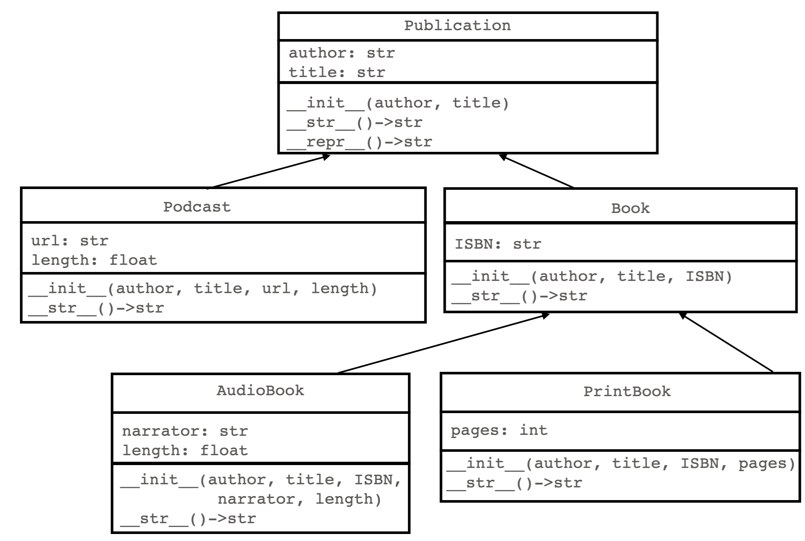

# Multilevel inheritance
If a child class itself has a child class, we call that *multilevel inheritance*. For example, suppose we have a class called `Publication`, which has two subclasses `Podcast` and `Book`. Then say `Book` itself has two subclasses, `AudioBook` and `PrintBook`. In multilevel inheritance, class diagrams are a particularly useful visualization tool.

## Class diagram of multilevel inheritance


The top-level class is sometimes referred to as a *grandparent* class, while a class two levels down is called a *grandchild*.

Side note: *multilevel inheritance* is different from *multiple inheritance*. You may find information about multiple inheritance online, which is the idea that a class can have more than one parent classes. Multiple inheritance is possible in python and C++, but not Java. We do not cover multiple inheritance in this course.

## UML diagram of multilevel inheritance
When we need more details than a class diagram, we use a UML diagram, which includes lists of instance variables as well as methods:



## Code example for multilevel inheritance

Here's the implementation of the 5 classes described above:
```python
class Publication:

    def __init__(self, author: str, title: str):
        self.author = author
        self.title =  title

    def __str__(self)->str:
        return f"author: {self.author}, title: {self.title}"

    def __repr__(self)->str:
        return self.__str__()
    
class Podcast(Publication):
        
    def __init__(self, author: str, title: str, url: str, length: float):
        super().__init__(author, title)
        self.url = url
        self.length = length

    def __str__(self)->str:
        return f"{super().__str__()},\n\turl: {self.url}, length: {self.length}"

class Book(Publication):

    def __init__(self, author: str, title: str, ISBN: str):
        super().__init__(author, title)
        self.ISBN = ISBN

    def __str__(self)->str:
        return f"{super().__str__()}, ISBN: {self.ISBN}"
    
class AudioBook(Book):

    def __init__(self, author: str, title: str, ISBN: str, narrator: str, length: float ):
        super().__init__(author, title, ISBN)
        self.narrator = narrator
        self.length = length

    def __str__(self)->str:
        return f"{super().__str__()},\n\tnarrator: {self.narrator}, length: {self.length}"
    
class PrintBook(Book):

    def __init__(self, author: str, title: str, ISBN: str, pages: int ):
        super().__init__(author, title, ISBN)
        self.pages = pages

    def __str__(self)->str:
        return f"{super().__str__()}, pages: {self.pages}"

# main code block:
publications = []
publications.append(Book(author = "F. Scott Fitzgerald", 
                         title = "The Great Gatsby", 
                         ISBN = "978-1328948854"))
publications.append(PrintBook(author = "William Goldman", 
                         title = "The Princess Bride", 
                         ISBN = "978-0544173767", 
                         pages = 496))
publications.append(AudioBook(author = "Ann Patchett", 
                              title = "Tom Lake", 
                              ISBN = "978-0063327528", 
                              narrator = "Meryl Streep", 
                              length = 682.0))
publications.append(Podcast(author = "Ira Glass", 
                            title = "This American Life - The Ghost of Bobby Dunbar",
                            url = "https://www.thisamericanlife.org/352/the-ghost-of-bobby-dunbar",
                            length = 58.1))

for publication in publications:
    print(publication)
```

output:
```
author: F. Scott Fitzgerald, title: The Great Gatsby, ISBN: 978-1328948854
author: William Goldman, title: The Princess Bride, ISBN: 978-1328948854, pages: 496
author: Ann Patchett, title: Tom Lake, ISBN: 978-0063327528,
        narrator: Meryl Streep, length: 682.0
author: Ira Glass, title: This American Life - The Ghost of Bobby Dunbar,
        url: https://www.thisamericanlife.org/352/the-ghost-of-bobby-dunbar, length: 58.1
```

Key points in the code example above:
* Consider the flow of information when instantiating an object of a grandchild class. For example, when instantiating an `AudioBook`, the `__init__()` method calls `super().__init__()`, which invokes the `__init__()` method for `Book`. But then the `__init__()` method for `Book` in turn calls `super().__init__()`, which invokes the `__init__()` method for `Publication`. So the information goes up the chain to the top-level class.
* A similar process occurs when the `Audiobook`'s `__str__()` method is called. It calls its parent's `__str__()` method, and that method in turn calls its parent's `__str__()` method. At each level the string is computed and returned down the chain, where it is combined with the string information passed back from the level above.
* In the main code block,  a list is created that holds a variety of objects from the 5 defined classes. Since regardless of type, each is also an instance of the `Publication` class, they can be treated in a homogenous way. Thus the for-loop can seamlessly traverse the objects and print them, even though they are potentially all of different subclasses.
* Predict what will be output by the following code:
```python
print(type(publications[2]))
print(isinstance(publications[1], Book))
print(isinstance(publications[3], Book))
print(isinstance(publications[2], Publication))
```
Answer:
```
<class '__main__.AudioBook'>
True
False
True
```