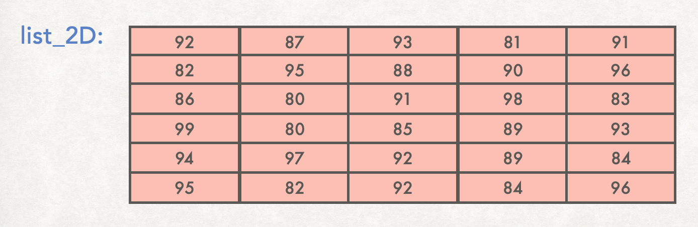
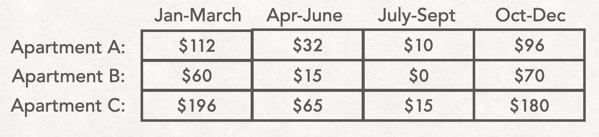

# Nested lists (also called 2D lists)
You've already learned about nested lists. The material below is a copy of the content found here: 
- [https://cs.du.edu/~intropython/intro-to-programming/2Dlists.html](https://cs.du.edu/~intropython/intro-to-programming/2Dlists.html)
- [https://cs.du.edu/~intropython/intro-to-programming/2Dlist_applications.html](https://cs.du.edu/~intropython/intro-to-programming/2Dlist_applications.html)
- [https://cs.du.edu/~intropython/intro-to-programming/2Dlist_define.html](https://cs.du.edu/~intropython/intro-to-programming/2Dlist_define.html)

## Two-dimensional lists

Think of a list as a linear storage of multiple values.

<figure>

</figure>


In python you can also have two-dimensional (2D) lists. A 2D list is a matrix or grid of values.

<figure>

</figure>

## Why do we need 2D lists?

There are many uses for 2D lists in programming. For example, many games require storage of information in two dimensions.
Writing a computer program in python to implement any of the following games would likely use a 2D list:

<figure>

</figure>

Another example is the storage of digital images, which can be stored as 2D lists. If you zoom in closely on a digital image, you will see that the image is composed of small squares of color called pixels (the word pixel comes from combining the words “<u>*pic*</u>ture <u>*el*</u>ements”).
So the image can be stored as a 2D grid of colors. In python this is a 2D list, or a list of lists.

<figure>

</figure>

Third, sometimes information is best organized in a grid. In these cases, the data would be stored in a 2D list. For example, here's a table that stores the temperature recorded by several different sensors at several times of day:
<figure>

</figure>


And here's a table showing the average heating bill for several different apartments during each quarter of the year:

<figure>

</figure>

Next we will look at how 2D lists are stored in python as lists of lists.

## Defining 2D lists in python

One way to create a 2D list in python is to use a 2D *list literal*. You've already learned how to create a 1D list literal, and the syntax here is similar. However, instead of a simple list, here we have a list of lists, or nested list.

The python code below creates a list of lists that stores the contents of the heating bill table shown above:

```python
heating_bill = [
    [112, 32, 10, 96],
    [60, 15, 0, 70],
    [196, 65, 15, 180]
]
```
Notice that `heating_bill` is a list with 3 items. Each item is itself a list. 
- The first element `heating_bill[0]` is itself a list: `[112, 32, 10, 96]`.
- The second element `heating_bill[1]` is itself a list: `[60, 15, 0, 70]`.
- The third element `heating_bill[2]` is itself a list: `[196, 65, 15, 180]`.

## How to access individual elements in a 2D list

<figure>

</figure>


Rather than focusing on a 2D list as a list of lists, another perspective is to think of it as a rectangular grid, each position having a row position and a column position. So to indicate a specific element, you give two index values. The first index gives the row and the second index gives the column.

For example:

- `heating_bill[0][0]` refers to row index `0`, column index `0`, whose value is `112`.
- `heating_bill[2][3]` refers to row index `2`, column index `3`, whose value is `180`.
- `heating_bill[1][2]` refers to row index `1`, column index `2`, whose value is `0`.

## Creating 2D lists using `for`-loops

Consider the following `4x3` 2D list, with all values initialized to `0`:
```python
temperature = [
    [0, 0, 0],
    [0, 0, 0],
    [0, 0, 0],
    [0, 0, 0]
]
```
This 2D list could be created more flexibly with the following code:
```python
# Create an empty list
temperature = []
# Four rows:
for row in range(4):
    # Create an empty sub-list
    new_row = [] 
    # Fill the row with three 0's   
    for column in range(3):
        new_row.append(0)
    # Put the newly-created row into the outer list:
    temperature.append(new_row)
```
