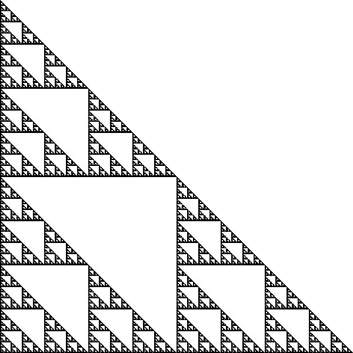
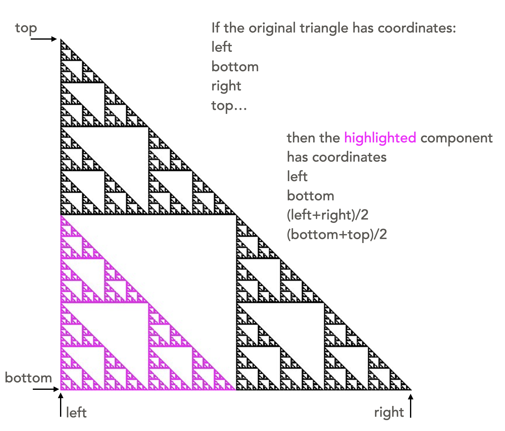
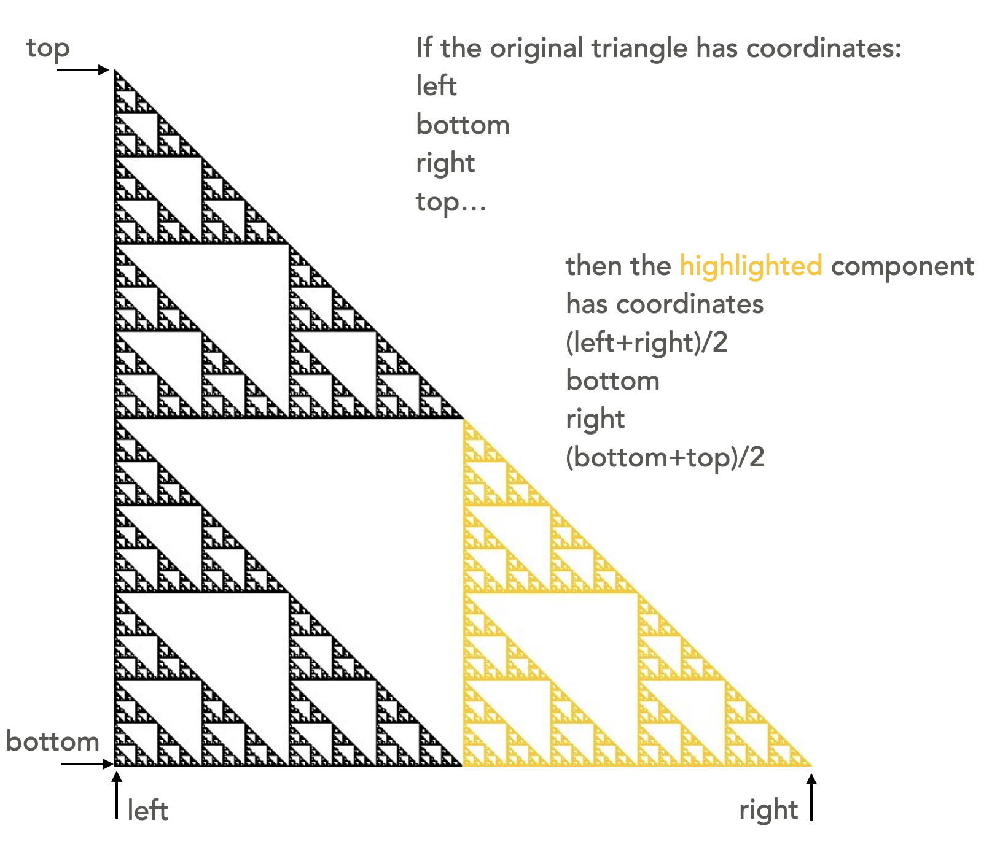
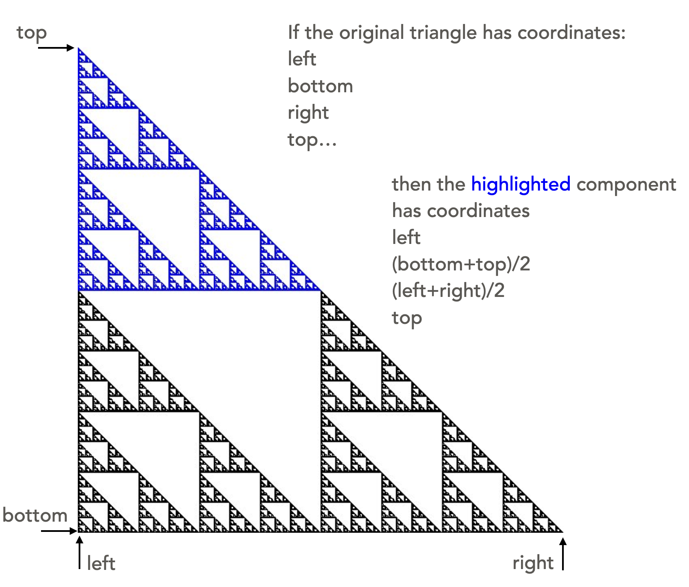
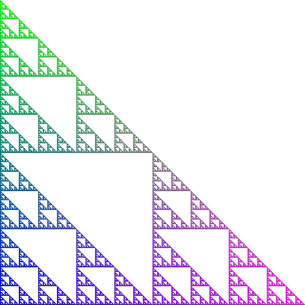

# Graphical example of recursion

Drawing fractals is a neat graphical application of recursion. Below is a drawing of a fractal called a *Sierpinski Gasket*, or *Sierpinski Triangle*:

 

Distinctive characteristics of a true fractal are:
* detail at all scales (zoom in as far as you like, and you still see the same level of detail), and
* self-similarity (the image is made up of three triangles, each of which is a scaled-down version of the full triangle).

Since we are drawing a computer image of a fractal, we do not actually see detail at all level. When we reach one pixel, we stop drawing further detail.

The self-similarity of the image is what enables us to draw the very complex image with a recursive function. This diagram shows how the figure comprises three miniature versions of itself. The three components of the fractal together create the image as a whole, and each component is itself a scaled-down replica of the larger image. The diagrams give the coordinates of each smaller sierpinski triangle relative to the larger whole.
<table style = "table-layout: fixed" max-width="900px">
<tr>
    <td></td>
    <td></td>
    <td></td>
</tr>
<tr> 
    <td>The coordinates are (left, bottom), ((left+right)/2, (bottom+top)/2)</td>
    <td>The coordinates are ((left+right)/2, bottom), (right, (bottom+top)/2)</td>
    <td>The coordinates are (left, (bottom+top)/2), ((right+left)/2, top)</td></tr>
</table>

Summarizing into the facts we need to build this drawing of a sierpinski triangle with coordinates (left, bottom), (right, top)
* base case: if the size is less than a defined cut-off, then draw a triangle with corners (left, bottom), (right, top)
* recursive relationship: the larger triangle is created by drawing the following:
  * a sierpinski triangle with coordinates (left, bottom), ((left+right)/2, (bottom+top)/2)
  * a sierpinski triangle with coordinates ((left+right)/2, bottom), (right, (bottom+top)/2)
  * a sierpinski triangle with coordinates (left, (bottom+top)/2), ((right+left)/2, top)

The following implementation follows directly from the defined base case and recursive relationship.
```python
import dudraw
# parameters passed are bottom, left, right, top
# Draw a Sierpinski triangle in that bounding box
def draw_sierpinski(l: float, b: float, r: float, t: float):
    # base case: if region is small, just draw a triangle:
    if r-l <= 0.001:
        dudraw.filled_triangle(l, b, r, b, l, t)
    # recursive calls:
    else:
        # draw three smaller Sierpinski triangles:
        draw_sierpinski(l, b, (l+r)/2, (b+t)/2)
        draw_sierpinski((l+r)/2, b, r, (b+t)/2)
        draw_sierpinski(l, (b+t)/2, (l+r)/2, t)

def main():
    dudraw.set_canvas_size(600,600)
    # draw a Sierpinski triangle to fill the canvas:
    draw_sierpinski(0, 0, 1, 1)
    dudraw.show(float('inf'))

if __name__ == "__main__":
    main()
```

To add a little color, we can control the colors based on the position on the canvas. In the line of code below, the red value of the color is controlled by the current left edge of the triangle, and the blue and green are controlled by the value of the bottom edge. Insert this line right before the triangle is drawn in the base case, and try running it!
```python
        dudraw.set_pen_color_rgb(int(255*l), int(255*b), 255-int(255*b))
```

Output:



## Video explanations

The ideas:

<video src="https://cs.du.edu/~ftl/1352/videos/recursion/fractal_concepts.mp4" width="480" height="270" controls></video>

The implementation:

<video src="https://cs.du.edu/~ftl/1352/videos/recursion/fractal_implementation.mp4" width="480" height="270" controls></video>


