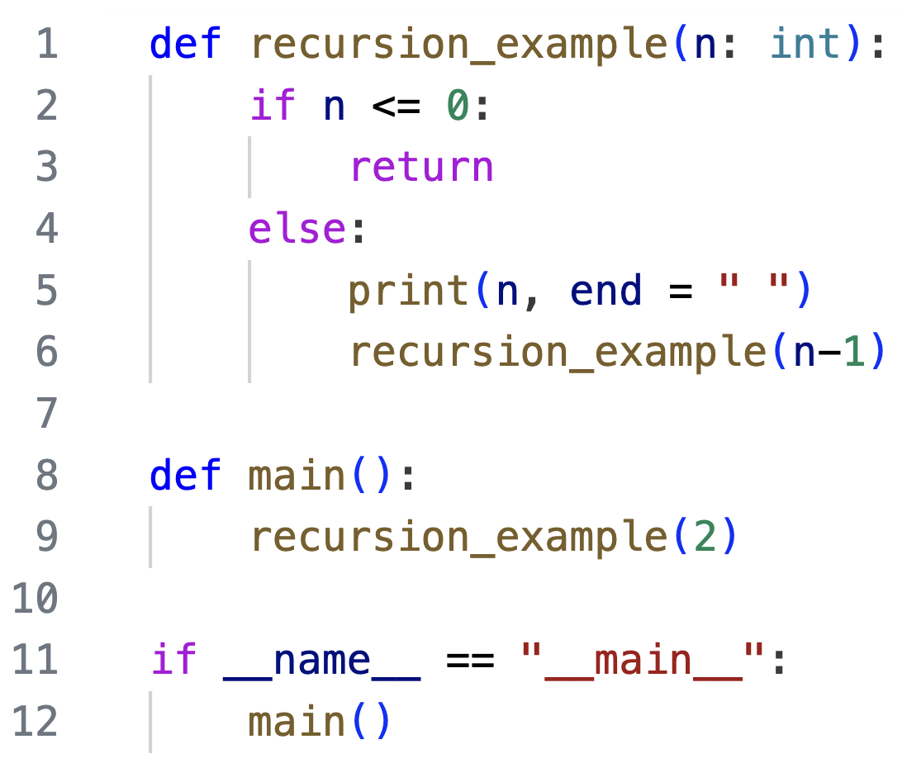
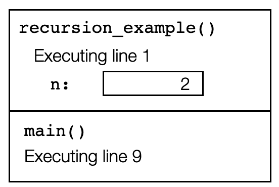
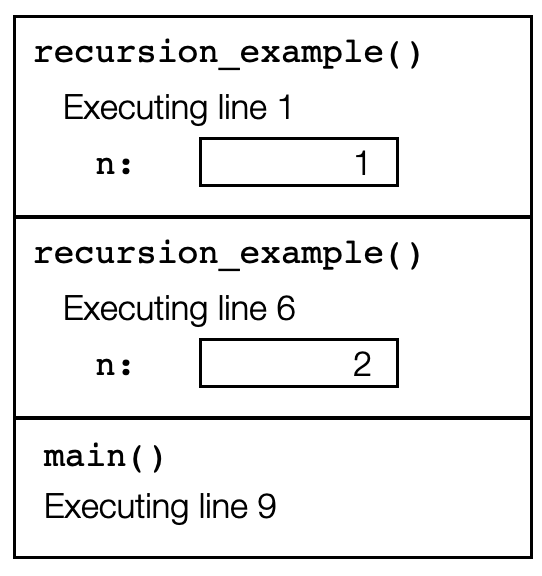
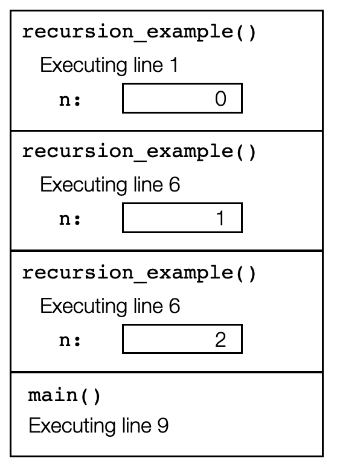
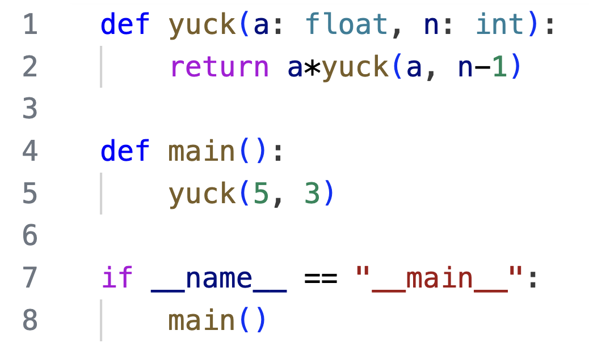
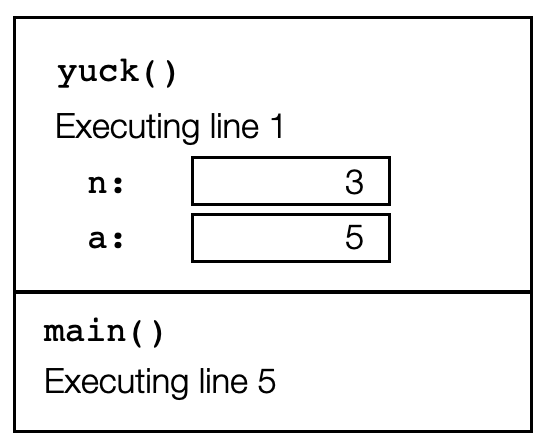
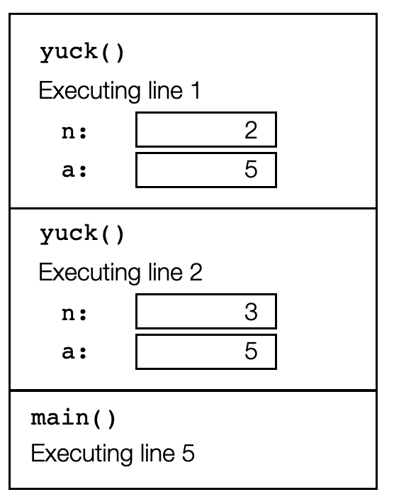
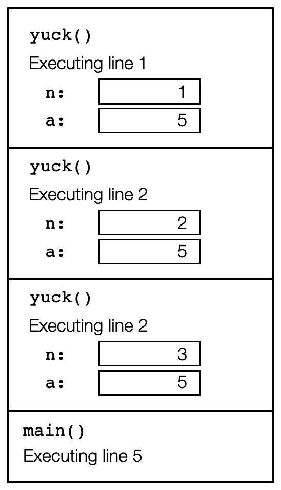
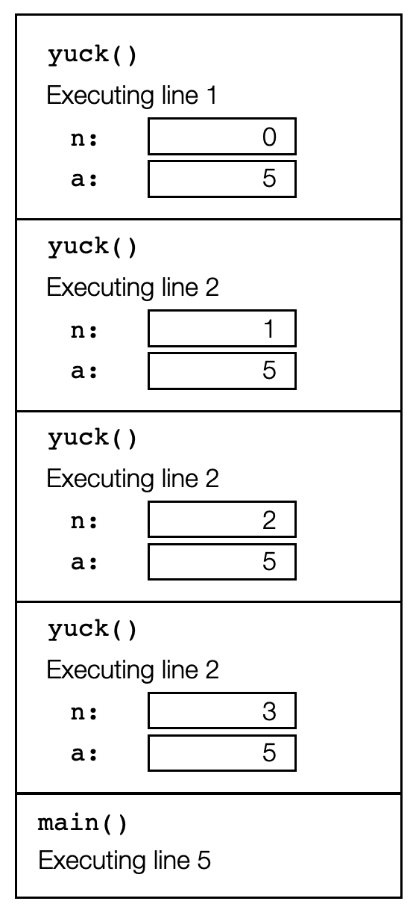

# Recursion

Background: In order to fully comprehend the idea of recursion, it's essential that you fully understand how the call stack works in tracking function calls. Please make sure you are solid on [call stack memory diagrams](../functions/call_stack.md)

## The idea of recursion 

You're very familiar with the idea that a function can call on (invoke) another function to perform a subtask for it. The beautiful, powerful, and mind-blowing idea of recursion is that a function can actually call *itself* to perform a subtask.

## Tracing through a recursive function, first example

 As a first recursion example, consider the following code. Notice that on line 6 the function `recursion_example()` make a call to *itself*, with the value of the parameter reduced by 1:

 

Let's trace through this function carefully, building a call stack. On line 12 `main()` is called, and then on line 9, `recursion_example()` is called with an argument of 2, putting us on line 1 of the program. Here's an image of the call stack at that moment:




On line 2, we see n is not less than or equal to 0, so we proceed to the else block. On line 5, the number 2 is output to the terminal. On line 6, we call `recursion_example()`, this time with an argument of 1. We jump to line 1 of the code, but notice this is a new function call. This means a new frame must get pushed onto the call stack. The call stack now has *two* frames with calls to `recursion_example()`:



We proceed again to line 2, we see n is not less than or equal to 0 this time either, so we proceed to the else block. On line 5, the number 1 is output to the terminal, On line 6, we call `recursion_example()`, this time with an argument of 0. We jump to line 1 of the code, but notice this is a yet a new function call! This means yet a new frame must get pushed onto the call stack. The call stack now has *three* frames with calls to `recursion_example()`:



Just when you feared this process would go on forever, we see that this time on line 2, n *is* less than or equal to 0. We call this a *base case*, which stops the recursion. So on line 3 we return from the most recent call. When we return from a call to a function, the top frame is popped off of the stack, so we can continue executing from where we left off in the calling function. Here's the call stack with the top frame popped, putting us back into our second call to `recursion_example()`, on line 6:


But this is the last line of the function, so we return to the caller, popping the top frame off of the stack:


We are back on line 6 of our first call to `recursion_exaple()`. But this is the last line of the function, so we return to the calling function `main()`, popping the top frame off of the stack:


This is the last line of the function, and the program is complete. Notice how the call stack built up through the recursion, as the function was called repeatedly. Then, as each instance of the function completed, the call stack rewinds, until execution is complete.

## Tracing through a recursive function, second example

Consider the following code, using a second example of a recursive function:

 

On line 8 `main()` is called, which on line 5 calls the function `yuck(5, 3)`. At this point, our call stack looks like this:



Next, line 2 is executed, which calls `yuck(5, 2)`:



The process seems to proceeding smoothly, like the previous example. Next, line 2 is executed, which calls `yuck(5, 1)`:



We continue on. Next line 2 is executed, which calls `yuck(5, 0)`:



Now line 2 is executed, which calls `yuck(5, -1)`. At this point we begin to realize that this time the recursive process will not ever stop. The stack will just keep growing larger and larger, never returning. Yuck! This is called *infinite recursion*, and happens whenever we fail to provide a base case to stop the recursion. This bug results in the program eventually crashing, with a recursion error, and the message
```
RecursionError: maximum recursion depth exceeded
```
To avoid this problem, every recursive function must contain conditions to stop the recursion in at least one base case.

In the next section you will see some examples of implementing recursive functions that perform useful and interesting tasks.
