# Complete tracing through recursive functions

## Building the stack sets up the computation, which is done while unwinding the stack
During execution of a recursive function, the call stack is built. As we return from the recursive calls, the frames are popped off of the call stack, and the stack is unwound. The building of the call stack should be considered part of the computation, as the structure of the call stack often stores the information that will be processed as the stack is unwound. For example, consider the execution of the following code:

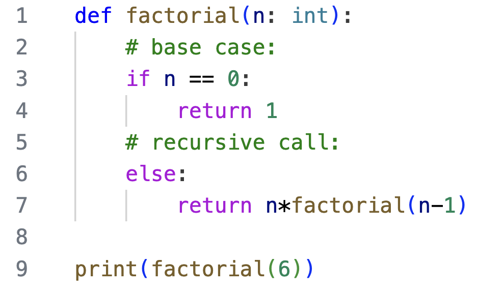

Notice that the call to `factorial(6)` results in a stack of 8 recursive calls. Trace through it yourself to confirm this call stack is correct at the deepest level reached:

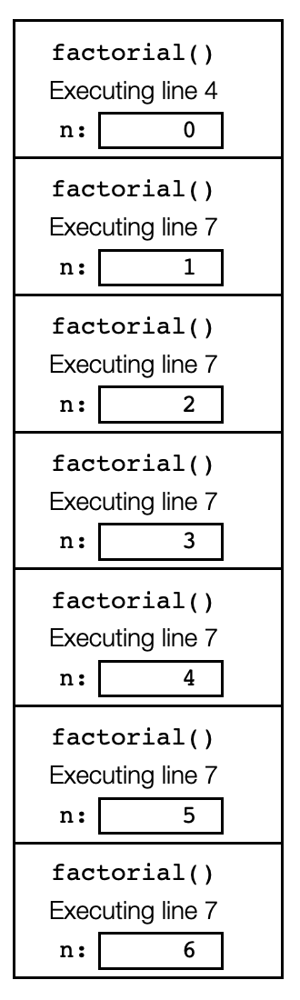

The call stack has the values of n all lined up and ready to go - as we unwind the stack, each time the previous return value is multiplied by n, and that product is then returned to the next frame down the stack:

<table style = "table-layout: fixed" max-width="900px">
<tr>
    <td valign = "bottom">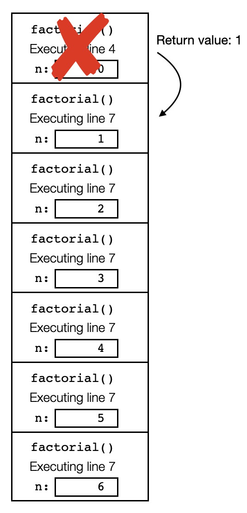</td>
    <td valign = "bottom">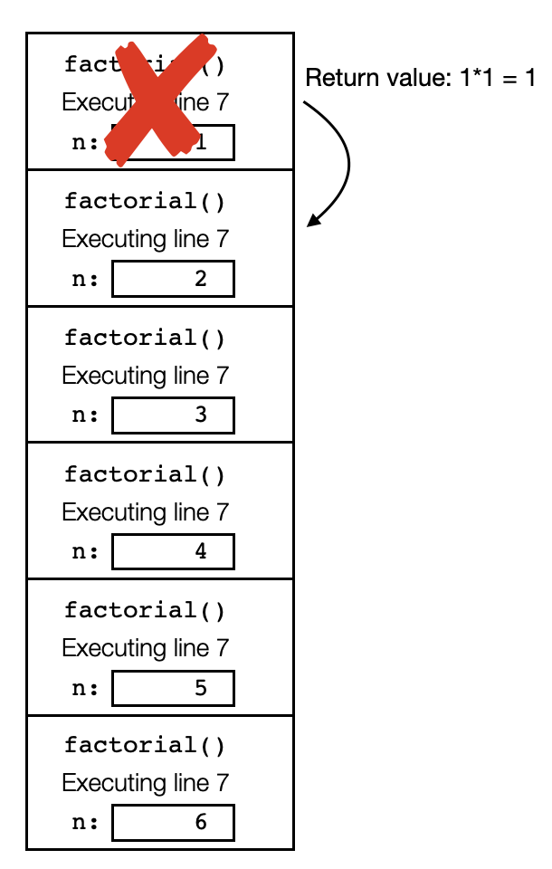</td>
    <td valign = "bottom">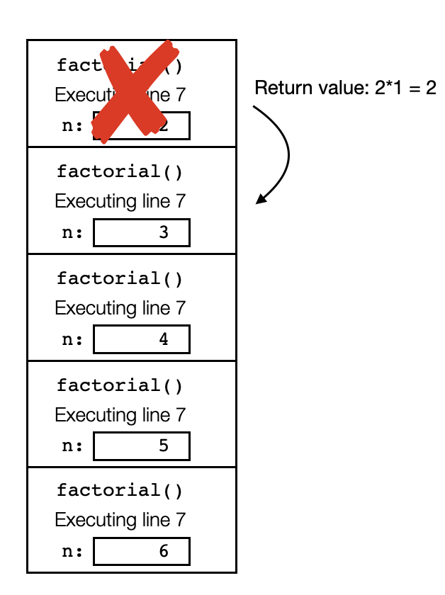</td>
    <td valign = "bottom">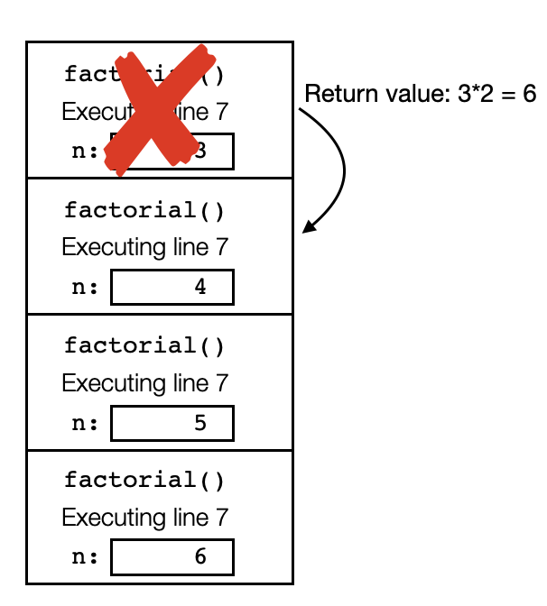</td>
</tr>
<tr> 
    <td>Return from call with n = 0</td>
    <td>Return from call with n = 1</td>
    <td>Return from call with n = 2</td>
    <td>Return from call with n = 3</td></tr>
<tr>
    <td valign = "bottom">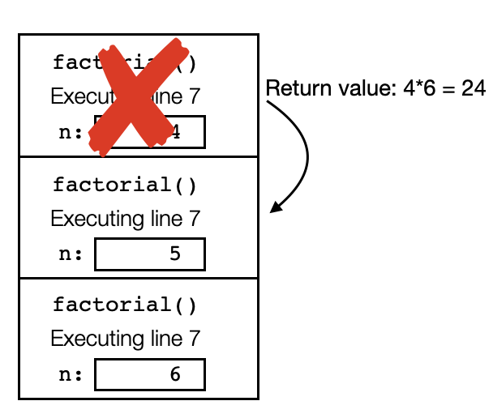</td>
    <td valign = "bottom">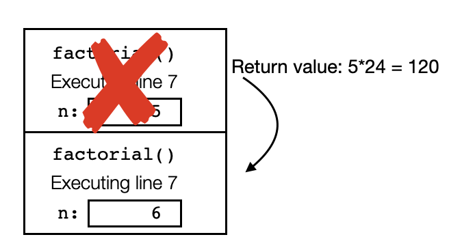</td>
    <td valign = "bottom">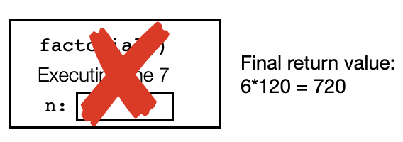</td>
</tr>
<tr> 
    <td>Return from call with n = 4</td>
    <td>Return from call with n = 5</td>
    <td>Return from call with n = 6</td></tr>
</table>

## The order that lines are executed might surprise you

Consider the following code, with a call to a recursive function:

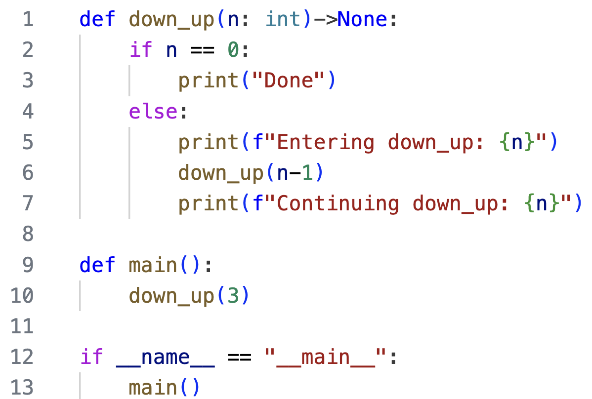

Notice there is a `print()` statement both before and after the recursive call. Before continuing reading, carefully trace the code (using a call stack) and determine the output. Pay close attention to the order of each output line.

First line 10 executes, and invokes `down_up(3)`. The base case is skipped, the code proceeding to line 5. The text `Entering down_up: 3` is output. Then on line 6, a recursive call is made `down_up(2)`. Entering that function, the base case is skipped again, the code proceeding to line 5. The text `Entering down_up: 2` is output. Moving to line 6, a recursive call is made `down_up(1)`, and upon entering that function we skip the base case, outputting `Entering down_up(1)`. Moving to line 6, a final recursive call is made `down_up(0)`. This time we enter the function one line 1, and here is the state of the call stack at that point:

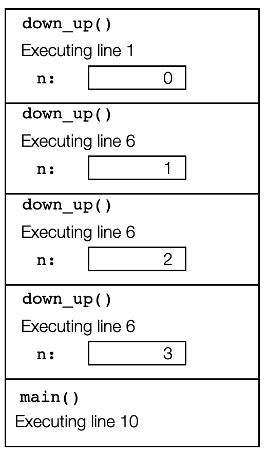

This time, since n is 0, we enter the base case and output `Done`. Now we begin returning from the recursive calls. When the first frame is popped off the stack, we re-enter the call to `down_up` with n = 1 on line 6. Proceeding to line 7, we output `Continuing down_up: 1`. The function is done executing, so we pop the top frame off the stack, returning to line 6 in the call with n = 2. Then on line 7, we output `Continuing down_up: 2`. Again this function is done executing, we pop the top frame from the stack, and proceed to line 7 of the call to `down_up` with n = 3. We output `Continuing down_up: 3`. The complete output is:
```
Entering down_up: 3
Entering down_up: 2
Entering down_up: 1
Done
Continuing down_up: 1
Continuing down_up: 2
Continuing down_up: 3
```
Notice that lines executed *before* the recursive call are executed as the stack is being built, so they occur in the order that n is passed to the function (in this case, since we call `down_up(n-1)`, the values of n are decreasing). But lines executed *after* the recursive call are executed as the stack unwinds. So they are output in the reverse order.

## Video explanations
First recursion example, with flaws:

<video src="https://cs.du.edu/~ftl/1352/videos/recursion/recursive_trace.mp4" width="480" height="270" controls></video>